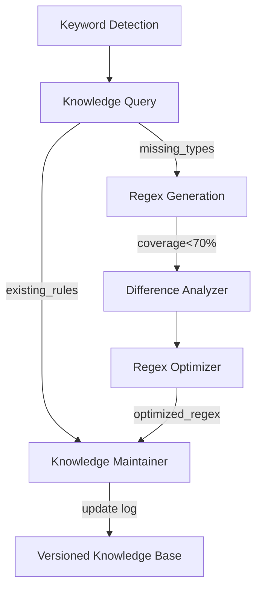

# toDoList
✅: 已完成的任务
🚧: 正在进行的任务
❌: 未完成的任务

### 2025.1.21-23

✅1.分析官方数据分布 data_analysis/json_parser.py   11/400

✅2.调研如何使用Qwen-2.5-72B - 完成

🚧3.智能体框架设计 - 对比试验

# 2025.2.20-2.21
## 任务分析
一看这要求，要求你使用智能体框架，并且更新高精度规则，那么很自然地就想到分成几个不同部分的智能体并分配工作。

分别代号为1，2，3，4，5
### Keywords Extraction Agent 关键字提取代理 
负责在`logText`里分析所有需要提取的关键字列表，生成这些键的列表，只需要提取提供的键，不需要提取额外的值。这里是生成一系列分类的键，用于对应所要对一个`logText`提取的时候所使用的正则提取式拼接组合。
比如，一条日志明文里面包含ip, port, session_id; 那么这些类别应该被生成。

若这些类别已经出现在知识库，则直接使用并计算筛选结果，若不满足命中100%进入正则优化代理进行优化，否则进入正则提取代理生成正则+匹配函数。
输入：logText, logField
输出1：logText, logField*, generated_logField, type_list
输出2：type_list: {...}, logText: "..."

### Regex Generation Agent 正则提取代理
根据输入的`logText`和`logField`内容，生成相应的正则表达式+匹配函数，并验证合理性。
如果计算结果不合理（匹配率过低<70%）则传递给差异提取代理，生成差异内容。
如果计算结果合理（匹配率合理>=80%），则证明这个正则合理加入知识库，传给维护代理。
输入：logText, logField, type_list
输出1：generated_logField, logField, logText
输出2：regex, func, type_list 

### Optimization Agent 正则优化代理
负责把当前所使用知识库的正则做优化，使用当前正则+匹配函数，比较筛选出来的结果和标准值的差异。
优化正则表达式和匹配函数。

输入：generated_logField, logField*, logText, type_list, reasons
输出：regex, func, type_list

### Difference Extraction Agent 差异提取代理
根据输入的Generated内容和标准答案，对比没有被提取出来的字段和明文部分，和错误原因，将其组合输入给正则提取代理。
输入：generated_logField, logField, logText
输出：logText*, logField, reasons

### Update Agent 维护代理
负责更新知识库内容，默认使用用户提供的知识库正则，出现由正则提取代理传过来的正则，则先进行二次验证：
若传过来的正则未在知识库类别里，则生成新的组件，并验证合理性。
若存在，则计算新旧组件对于当前明文的的匹配率，选最高匹配率的一个保留。

## 实验对比
官方标准：
  - 字段抽取正确: 解析结果中字段的 key 和 value 与人工打标的对应字段相等, 则认为字段抽取正确。
   - 匹配日志: 对于每条日志, 人工打标的结果中至少有一个字段抽取正确, 认为该条日志能被规则匹配。
   - 完全匹配日志: 对于每条日志,人工打标的结果中所有字段均抽取正确, 认为该条日志能被规则完全匹配。

基于字段抽取和日志匹配情况, 可以计算匹配率与完全正确率进行最终打分:
   - 匹配率 = (匹配日志数 / 总日志数) * 100%
   - 完全正确率 = (完全匹配日志数 / 总日志数) * 100%

`metric = 匹配率 * 0.4 + 完全正确率 * 0.6`

按照道理来说完全匹配率越高越好，但实际上的情况是不可能完全匹配，则是尽可能输出多的key-value对用于计算覆盖率，就是尽量覆盖参考值的内容，尽管有些不属于参考值。就是Soundness的概念，尽可能输出多的解决方案，尽管有错，但是包含Truth的值。
### 人工生成正则筛选器
通过人工分类得到默认的正则表达式列表，用于几种不同类型的日志进行提取分析。这里我分别选取几种不同范围的日志来检测我人工手动建立的知识库的覆盖率：
| Index | Coverage(Mine) | Matched(Official)|  Perfect_Macthed(Official) |  70%< Coverage Count(Mine)|
|--|--|--|--|--|
| 0 - 5 | 91.0% | 100.0% | 0.0% |  0 |
| 0 - 10 | 91.0% | 100.0% | 0.0%|  0 |
| 0 - 100 | 84.6% | 100.0% | 1.0%  |  15 |
| 0 - 400 | 79.6% |  98.2%| 0.2% |  106 |
| 100 - 200 | 81.1% | 99.0% | 0.0% |  27 |
| 120 - 125 | 92.0% | 100.0% | 0.0% |  0 |
| 200 - 300 | 66.9% | 95.0% | 0.0%|  46 |
| 300 - 400 | 71.0% |  99.0% | 0.0% |  39 |

### LogParserX框架

